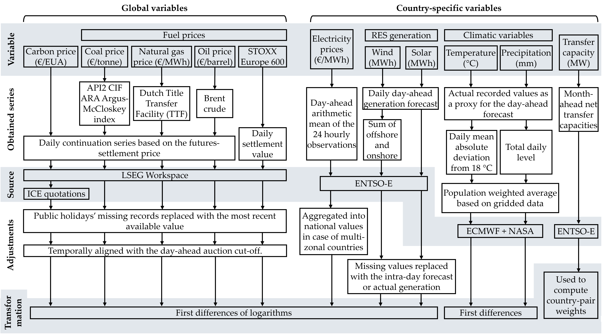
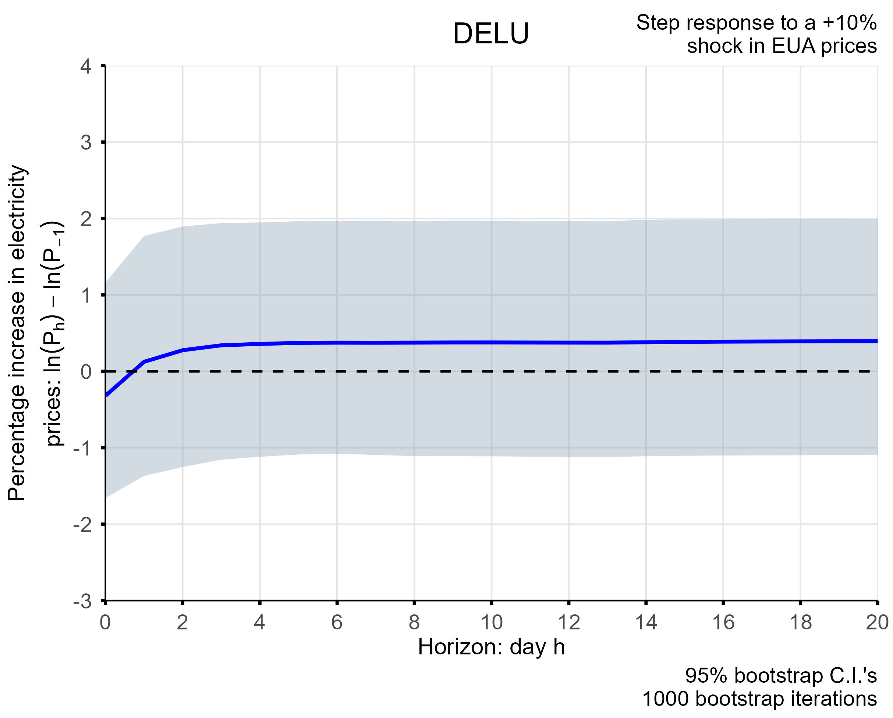
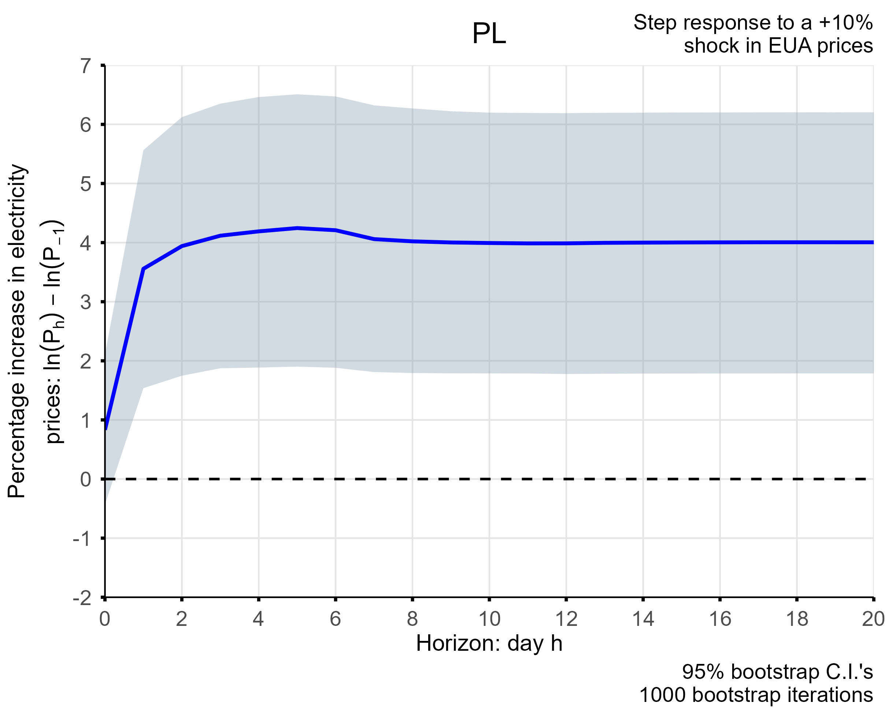
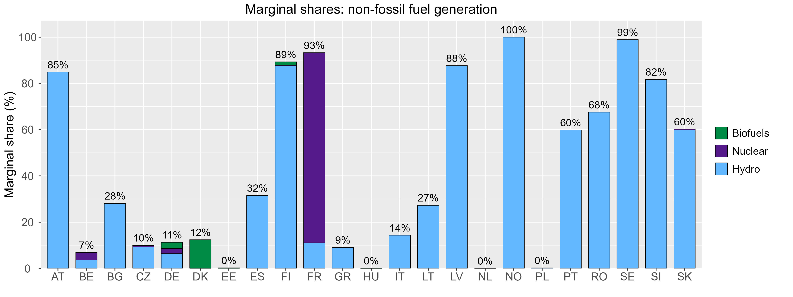

# GVARX EU ETS - electricity prices model

## Overview

### The Business Problem: Decarbonisation vs. Affordability
Europe faces a critical trade-off: achieving decarbonisation goals via the EU Emissions Trading System (EU ETS) while keeping energy affordable. As carbon prices rise, two key uncertainties emerge:
- **Policy Effectiveness**: Do higher carbon costs successfully displace high-emission generation, or do they merely inflate consumer bills without reducing emissions?
- **Market Contagion**: With a highly interconnected European grid, how do price shocks in one country spill over into neighboring markets?

### Project Description
This project adapts the Global Vector Autoregressive (GVAR) econometric framework (proposed by M.H. Pesaran et al., 2004) to the energy sector, quantifying the elasticity of national electricity prices to EU carbon allowance shocks.

After constructing a tailored panel dataset for 23 selected Member States, I developed a GVAR model with exogenous components (GVARX). This framework:

- Isolates the impact of EU-wide shocks from domestic market dynamics.
- Captures cross-country interdependencies while avoiding the curse of dimensionality typical of large-scale multivariate systems.

_For a more detailed explanation of the project context and results, refer to the [Executive Summary](./documents/executive_summary.pdf)._

## Table of Contents

- [Project Tree](#project-tree)
- [Data](#data)
    - [Conceptual Scheme](#conceptual-scheme)
    - [Data Availability](#data-availability)
- [Technical Appendix](#technical-appendix)
- [Running the Analysis](#running-the-analysis)
    - [Dependencies](#dependencies)
        - [Installation](#installation)
    - [Usage](#usage)
- [Results](#results-to-put-it-very-concisely)
    - [Key Findings](#key-findings)
        - [Drivers of Cost Transmission](#drivers-of-cost-transmission)
        - [Visualisation Examples](#visualisation-examples)
    - [Implications](#implications)

## Project Tree

```text
gvar-euets-electricity-model
├── data
│   ├── processed
│   │   ├── total_precipitation_and_2m_temperature_weighted
│   │   │   ├── era5_weighted_*.xlsx                      <- Climatic variables weighted by population with an hourly granularity
│   │   │   └── era5_weighted_daily_2017-2025             <- Climatic variables weighted by population with a daily granularity
│   │   ├── final_data_levels.xlsx                        <- Final data used for the main analysis (not transformed)
│   │   ├── final_data_transformed.xlsx                   <- Final data used for the main analysis (transformed)
│   │   └── non_specific_time_series_adjusted_for_missing_weekend_days.xlsx    <- EU-wide variables adjusted for missing daily values
│   └── raw
│       ├── country_specific
│       │   ├── total_precipitation_and_2m_temperature    <- Raw climatic and population data
│       │   ├── electricity_prices_not_transformed.xlsx   <- Daily mean day-ahead electricity prices
│       │   └── ftcs_time_series.xlsx                     <- Forecasted transfer capacities (daily data)
│       ├── visualisations                                <- Data used for creating charts and interpreting the results
│       └── non_specific_time_series.csv                  <- EU-wide variables not yet adjusted for missing daily values
├── documents
│   ├── executive_summary.pdf                             <- Useful as a more detailed overview of the project
│   └── technical_appendix.pdf                            <- Useful to understand the underlying functioning of the model I built
├── images
│   ├── interpretation_and_complementary                  <- Visualisations used to interpret the results + a data conceptual scheme
│   └── results                                           <- Obtained impulse response functions
├── scripts
│   ├── preprocessing                                     <- Scripts used to obtain and prepare the data for the analysis
│   └── visualisations                                    <- Scripts used to create the visualisations
├── gvarx-euets-electricity-model.Rproj                   <- RProject file
├── gvarx_computation.R                                   <- Code used for the main analysis
└── README.md
```

## Data

### Conceptual Scheme
For a visual overview of how the variables interact within the model, refer to the conceptual scheme below:


### Data Availability
While all the data required to run the GVARX model can be found in [this](./data) folder, the raw source file for the calculation of climatic variables (approx. 100GB) is excluded due to size limitations. This, nonetheless, is not needed to run the main analysis. If, however, you wish to reproduce the preprocessing pipeline from scratch ([this](./scripts/preprocessing/data_preparation_total_precipitation_and_2m_temperature.R) script), follow these steps:

#### 1. Download Raw Data
- **Source**: [Copernicus ERA5 Reanalysis](https://cds.climate.copernicus.eu/datasets/reanalysis-era5-single-levels?tab=download).
- **Product Type**: Select "Reanalysis."
- **Variables**: Select "2m temperature" and "Total precipitation."
- **Granularity**: Due to processing time constraints, measurements were retrieved at 3-hour intervals (00:00, 03:00, 06:00, etc.)
- **Geographical area**: Select "Whole available region."
- **Format**: `.grib`

#### 2. File Placement
Place the downloaded `.grib` file into the following directory: `data/raw/country_specific/total_precipitation_and_2m_temperature`.

#### 3. Execution
Run this [preprocessing script](./scripts/preprocessing/data_preparation_total_precipitation_and_2m_temperature.R).

## Technical Appendix

The econometric modelling and mathematical derivations behind the project are available in the [Technical Appendix](./documents/technical_appendix.pdf).

This document serves as the theoretical backbone of the main code (`gvarx_computation.R`), detailing:
- The step-by-step estimation strategy and derivation of the GVARX system.
- The mathematical treatment of cross-country weights and exogenous variables.
- The derivation of Cumulative Impulse Response Functions (CIRFs) and the bootstrap procedure used to generate confidence intervals.

## Running the Analysis

### Dependencies
The analysis is performed in **R**. To reproduce the results, ensure the following packages are installed:

- **Core & Data Manipulation**:
    - `tidyverse` (includes `dplyr`, `tidyr`, `ggplot2`, `lubridate`).
    - `readxl`, `writexl`, `openxlsx` (Excel I/O).
    - `xml2`.
- **Econometrics & Time Series**:
    - `forecast` (ARIMA modelling).
    - `zoo` (Time series objects).
    - `MASS` (Statistical functions).
- **Spatial Analysis**:
    - `sf` (Simple features for shapefiles).
    - `terra`, `raster` (Gridded data processing).
    - `exactextractr` (Zonal statistics).
    - `rnaturalearth` (Map data).
- **Visualisation**:
    - `scales` (Plot formatting).

#### Installation
You can install the dependencies above by running the following command:
```r
install.packages(c(
  "tidyverse", "readxl", "writexl", "openxlsx", "xml2",
  "forecast", "zoo", "MASS",
  "sf", "terra", "raster", "exactextractr", "rnaturalearth",
  "scales"
))
```

### Usage
Since the data needed to run the main script is already included in the repository (`data/processed`), you can go straight to the main analysis. To replicate the GVARX model estimation and generate the Impulse Response Functions:
1. Open `gvarx-euets-electricity-model.Rproj`.
2. Open the main script: `gvarx_computation.R`.
3. Run the script.

The code will automatically:
- Load the processed data from `data/processed/`.
- Estimate the individual ARX models.
- Solve the Global VARX system.
- Generate the results plots.

## Results (to put it very concisely)

### Key Findings
The analysis reveals that the impact of European Union Allowance (EUA) prices on electricity markets is systematic, driven by identifiable structural characteristics rather than random noise.

#### Drivers of Cost Transmission
- **Marginality vs. Volume**: The frequency with which a technology sets the marginal price is often more decisive than its total generation share. High-emission marginal units drastically increase price elasticity to carbon shocks.
- **Interconnection as a Buffer**: Strong integration dampens cost transmission, provided the trading partners have low-emission profiles. Cleaner imports can displace domestic high-carbon bids, shielding consumers from price spikes.
- **Market Power**: Higher market fragmentation (competition) and state ownership tend to attenuate the pass-through of carbon costs, whereas concentrated private ownership amplifies it.

#### Visualisation Examples
- **Impulse Response Analysis**: The model quantifies exactly how a shock to carbon prices propagates through each national market over time. 
(Example: Responses of Germany and Poland electricity prices to a 10% EUA price shock)
<p align="center">
  
  

- **Structural Interpretation**: To explain these responses, I analysed several structural determinants, such as the marginal role of non-fossil generation across the 23 countries.


Other key visualisations can be found [here](./images/interpretation_and_complementary).

### Implications
These findings clarify the trade-off between environmental stringency and energy affordability.

- If carbon costs are simply passed through without displacing dirty generation, the ETS disproportionately hurts consumers without accelerating decarbonisation.
- When higher prices trigger a displacement of high-emission units, the ETS promotes the green transition efficiently.

Want the full story? For a more detailed breakdown of policy recommendations, forecasting applications, and specific country diagnostics, you can read the [Executive Summary](./documents/executive_summary.pdf). Alternatively, the full work is published [here](https://hdl.handle.net/10589/243429).
